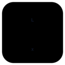
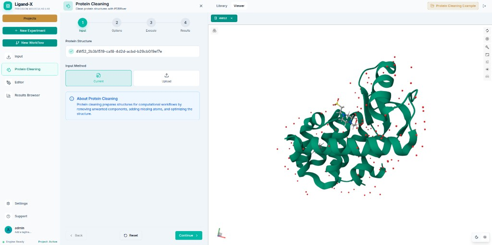

<p align="center">
  
</p>

# Ligand-X Launcher

**Local drug-discovery workstation — install once, run on your machine.**

[Ligand-X Inc.](https://www.ligand-x.com) builds Ligand-X, a computational chemistry
platform for structure preparation, docking, molecular dynamics, and related
workflows. The launcher is the supported desktop entry point for Windows, Linux,
and macOS: it installs a signed runtime, pulls the images you need, starts the
stack, and opens the app in your browser.

<p align="center">
  
</p>

<p align="center">
  <a href="https://github.com/kon-218/ligand-x-launcher/releases/latest"><strong>Download the latest release</strong></a>
  ·
  <a href="https://www.ligand-x.com">Website</a>
  ·
  <a href="docs/FAQ.md">FAQ</a>
</p>

## What you get

- **Free core** — structure tools, docking, MD, and related modules with no license file
- **Local by default** — data and compute stay on your machine behind Docker
- **Academic / Pro modules** — import a signed license when you need private capabilities
- **Guided install** — preflight checks, module selection, download progress, start/stop controls
- **Verified updates** — signed runtime selection and replacement; the UI never accepts an arbitrary image tag

Windows and Linux are the qualified launcher targets. macOS builds are preview and
cannot run NVIDIA-accelerated containers locally.

## Install and start

1. Install and start [Docker Desktop](https://docs.docker.com/get-docker/), or Docker Engine with Compose v2 on Linux.
2. Download the launcher for your platform from
   [Releases](https://github.com/kon-218/ligand-x-launcher/releases/latest).
3. Open the launcher and create your local account.
4. Continue with Free, or import a signed Academic/Pro license.
5. Select modules, choose **Download & continue**, then **Start services**.
6. Click **Open Ligand-X** and log in with the account you created.

The app opens at <http://localhost:8080> by default (`APP_PORT`).

## Requirements

- Docker with Compose v2
- 16 GB RAM for a small core installation (more for GPU / long-running modules)
- At least 20 GB free disk before selecting scientific images
- NVIDIA GPU and container runtime for accelerated modules
- Network access for the initial runtime and images

See the [FAQ](docs/FAQ.md) for platform notes and recovery guidance.

## Editions

| Edition | How you start | What it unlocks |
| ------- | ------------- | --------------- |
| **Free** | No license file | Core runtime modules |
| **Academic** | Signed academic license | Entitlements listed in that license |
| **Pro** | Signed commercial license | Entitlements listed in that license |

Importing a license later does not require reinstalling the launcher; you may need
to pull additional private images. Commercial use and Pro modules require
[commercial terms](https://www.ligand-x.com).

## Security

Public builds download runtime bundles only from allowlisted HTTPS hosts and verify
signature, version, size, and digest before install. Credentials are generated
locally; Pro registry access is scoped to your license.

Details, Windows signing status, and operational hygiene:
[Runtime security](docs/security.md).

## Building and contributing

The launcher is a Go + [Wails](https://wails.io/) v2 desktop app. Public release
builds compile with the `public` build tag and embed `frontend-public/`.

```bash
go test ./...
make dev-public
make build-public
make check-runtime-topology
```

Contributor setup, platform build notes, and topology sync rules live in
[CONTRIBUTING.md](CONTRIBUTING.md). The broader dashboard under `frontend/` is a
developer surface and is not shipped in public releases.

## Documentation

- [FAQ](docs/FAQ.md)
- [Runtime security](docs/security.md)
- [Contributing](CONTRIBUTING.md)
- [Manual Windows build](docs/manual-windows-build.md)
- [README image assets](docs/images/README.md)

## License

The launcher is distributed under the [PolyForm Noncommercial License 1.0.0](LICENSE).
Commercial use and licensed Pro modules require commercial terms from
[Ligand-X Inc.](https://www.ligand-x.com).
